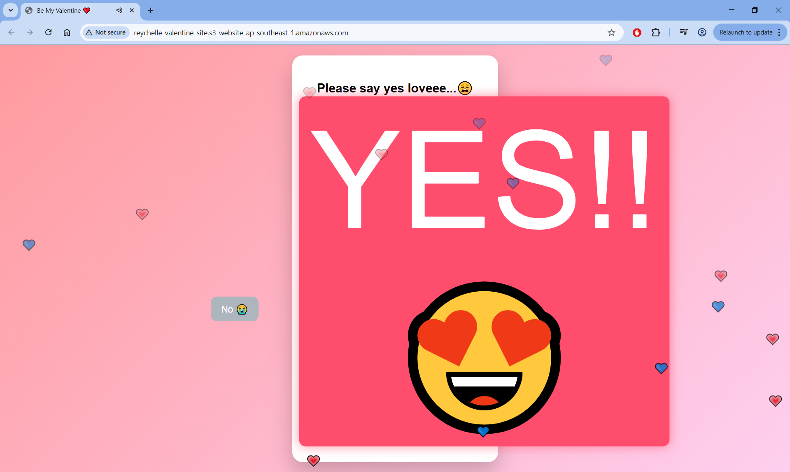
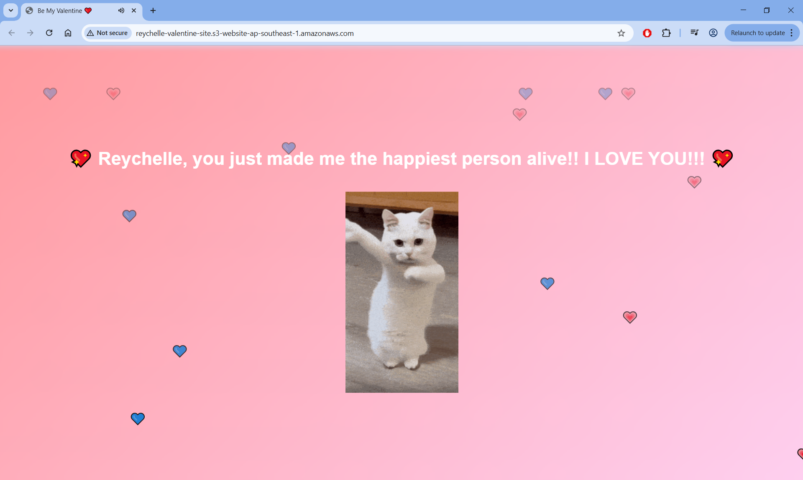

# ❤️ Interactive Valentine Web Experience (AWS Hosted)

An interactive romantic web application built using HTML, CSS, and JavaScript and deployed using AWS S3 Static Website Hosting.
This project demonstrates frontend animation techniques combined with cloud deployment fundamentals.

---

## 📸 Preview

### Main Interface

### Final Interaction

---

## ✨ Features

- Interactive YES/NO button logic
- Animated heart transformations
- Confetti particle effects
- Cinematic UI transitions
- Background music with dynamic audio mixing
- Mobile-friendly responsive design

---

## ☁️ AWS Architecture

This project uses AWS for static hosting:

User Browser → Amazon S3 Static Website Hosting → Web Application

Services Used:

- Amazon S3 (Static Website Hosting)
- Public Bucket Policy
- Global Web Access

---

## 🚀 Live Demo

http://reychelle-valentine-site.s3-website-ap-southeast-1.amazonaws.com

---

## 📂 Project Structure

├── src/
│   ├── index.html
│   ├── style.css
│   ├── script.js
│   └── assets/
│       ├── dancing-cat.gif
│       ├── bgsong.mpeg
│       └── yippee.mp3

---

## 🧠 What I Learned

- Deploying static websites using AWS S3
- Managing public bucket policies
- Handling character encoding issues in cloud environments
- Performance optimization for mobile devices
- Event-driven UI interactions

---

## 🔮 Future Improvements

- CloudFront CDN integration
- Custom domain with HTTPS
- Improved mobile performance optimization

---

## 📜 License

MIT License
